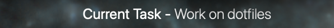

# current-task

<p align="center">
  
</p>

A simple Uebersicht widget to display my current task at the bottom of the screen because I do be losing track of what I'm meant to be doing sometimes.
Inspired by a similar widget used by [osu's dev peppy, as seen on his stream](http://twitch.tv/ppy).

Originally built to pull tags from Asana, but I've since switched to using Things exclusively for my daily task tracking so I've updated it to pull from Things as well. I might add more extensions as I go along.

The way it works is you tag your current task with the tag "Current" and the widget should pull it and display it.

## Installation

Just clone this git repo into your Uebersicht widgets folder:

```sh
git clone https://github.com/evangelos-ch/current-task ~/Library/Application Support/Übersicht/widgets/current-task
```

## Configuration

Look into the `options` object in `index.jsx`.

### Position

-   `verticalPosition`: The vertical position of the widget. Can be one of `"top"`, `"center"` or `"bottom"`. Defaults to `"bottom"`.
-   `horizontalPosition`: The horizontal position of the widget. Can be one of `"left"`, `"center"` or `"right"`. Defaults to `"center"`.

### Things

-   `enabled`: Whether or not to pull tasks from Things. Defaults to `true`.
-   `tag`: The tag to pull tasks from. Defaults to `"Current"`.

### Asana

-   `enabled`: Whether or not to pull tasks from Asana. Defaults to `false`.
-   `accessToken`: Your Asana access token. You can get one from [here](https://app.asana.com/-/developer_console).
-   `workspace`: The workspace name to pull tasks from.
-   `workspaceID`: This will be set automatically on widget startup when it looks up the workspace name using the API. But you can set it explicitly if you want.
-   `tag`: The tag to pull tasks from. Defaults to `"Current"`.
-   `tagID`: This will be set automatically on widget startup when it looks up the tag name in the given workspace using the API. But you can set it explicitly if you want.
